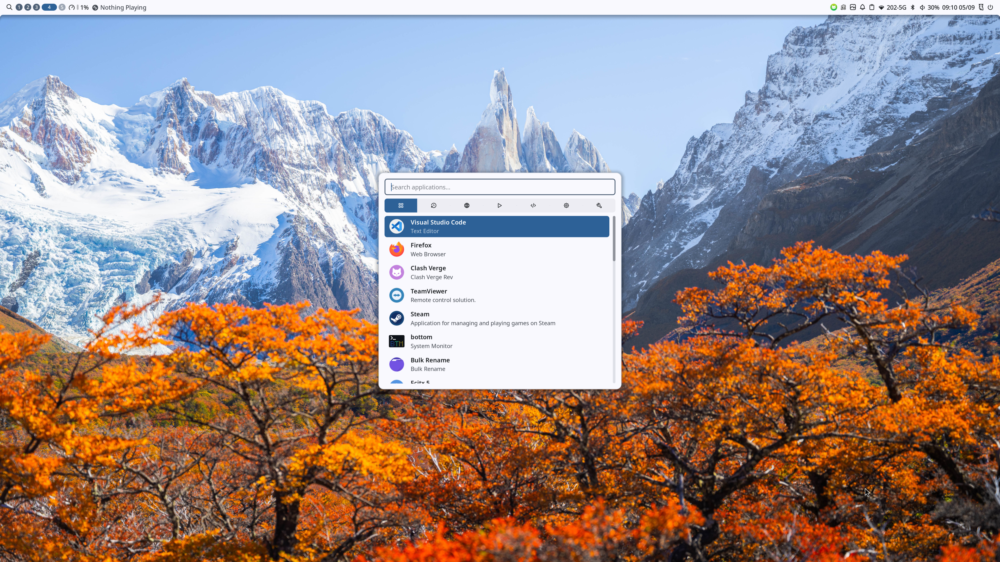

# ywxt NixOS configuration

This is the Flake-based NixOS configuration stored at `~/nixos-config`. It
targets two hosts that share a common desktop and user configuration while
retaining host-specific hardware and development modules:

- `ywxt-ws`: personal desktop on AMD hardware
- `ywxt-work`: work machine with an Intel i7-12700 and UHD Graphics 770

User-level configuration is managed with hjem instead of Home Manager.

## Screenshot



## Included

- NixOS unstable pinned by `flake.lock`
- Two hosts, `ywxt-ws` and `ywxt-work`, registered as
  `nixosConfigurations.ywxt-ws` and `nixosConfigurations.ywxt-work`
- Shared Nix settings (CERNET mirror, Noctalia Cachix and seven-day GC) in
  `modules/nix-settings.nix`
- hjem using the same nixpkgs instance
- Niri with a 4K `DP-1` layout on `ywxt-ws` and shared keybindings/rules
- Noctalia from its official Flake with a validated hjem-managed configuration
- TTY login startup through Fish, UWSM and hjem
- Noctalia-native lock, idle and screen-off handling (no swayidle)
- Noctalia-native brightness handling (no explicit brightnessctl package)
- Clash Verge Rev via `programs.clash-verge` with `pkgs.clash-verge-rev`,
  including autostart and TUN service mode
- PipeWire, NetworkManager, Bluetooth and Wayland portals
- hjem-managed Fcitx5 with the pinned `ywxt/rime-huma` scheme,
  librime-lua support and Fluent light/dark themes
- Thunar with archive integration, removable-media support, GVfs, UDisks2 and
  thumbnail generation
- Declarative MIME associations matching the current Firefox, imv, VLC, Ark,
  VS Code, Thunar, Steam and Telegram defaults
- GTK, Qtct and Kvantum configuration with Noctalia-generated dynamic colors
- GNOME Keyring, Polkit and Git OAuth credential support
- AMD graphics/Vulkan, Steam, Gamescope and MangoHud on `ywxt-ws`
- Intel UHD 770 graphics on `ywxt-work` through `modules/hardware-intel.nix`:
  Vulkan, VAAPI (`intel-media-driver`) and QSV (`vpl-gpu-rt`), thermald,
  `kvm-intel` and Intel microcode
- Java, Python, C/C++, Nix and Typst development tools managed through hjem

Git, Git LFS, user Git settings and the OAuth credential helper are managed by
hjem for `ywxt`. Docker is enabled on both hosts by the shared development
module; Docker group membership grants root-equivalent privileges.

## Destructive clean installation

The following applies to `ywxt-ws` and erases `/dev/nvme0n1` completely. Confirm the device name from the
NixOS installer with `lsblk` before running anything. Boot the installer in UEFI
mode and put a copy of this Flake somewhere that will survive erasing the target
disk, such as a second USB drive, another disk or a remote Git repository.

From the live installer's normal shell, first copy or clone the configuration to
the installer's RAM-backed `/tmp`. For example:

```bash
cp -a /path/on/another-device/nixos-config /tmp/nixos-config
# Alternatively: git clone <repository-url> /tmp/nixos-config
test -f /tmp/nixos-config/flake.nix
```

Then become root, verify UEFI mode and inspect the target disk. Stop if the UEFI
check fails or `/dev/nvme0n1` is not the intended disk.

```bash
sudo -i
test -d /sys/firmware/efi/efivars
lsblk -o NAME,SIZE,TYPE,FSTYPE,LABEL,MOUNTPOINTS /dev/nvme0n1

wipefs -a /dev/nvme0n1
parted /dev/nvme0n1 -- mklabel gpt
parted /dev/nvme0n1 -- mkpart ESP fat32 1MiB 1025MiB
parted /dev/nvme0n1 -- set 1 esp on
parted /dev/nvme0n1 -- mkpart primary 1025MiB 100%
partprobe /dev/nvme0n1
udevadm settle

mkfs.fat -F 32 -n boot /dev/nvme0n1p1
mkfs.btrfs -f -L nixos /dev/nvme0n1p2

mount /dev/disk/by-label/nixos /mnt
btrfs subvolume create /mnt/@
btrfs subvolume create /mnt/@home
btrfs subvolume create /mnt/@nix
umount /mnt

mount -o subvol=@,compress=zstd:3,noatime,discard=async \
  /dev/disk/by-label/nixos /mnt
mkdir -p /mnt/{boot,home,nix}
mount -o subvol=@home,compress=zstd:3,noatime,discard=async \
  /dev/disk/by-label/nixos /mnt/home
mount -o subvol=@nix,compress=zstd:3,noatime,discard=async \
  /dev/disk/by-label/nixos /mnt/nix
mount -o fmask=0077,dmask=0077 /dev/disk/by-label/boot /mnt/boot
```

Verify that every target filesystem is mounted at the location expected by
`hosts/ywxt-ws/hardware-configuration.nix`:

```bash
findmnt -R /mnt
lsblk -f /dev/nvme0n1
```

Install directly from the RAM-backed configuration. It is used only to build the
initial system and is intentionally not copied to `/etc/nixos`.

```bash
nix --extra-experimental-features 'nix-command flakes' flake check path:/tmp/nixos-config
nixos-install --flake /tmp/nixos-config#ywxt-ws
nixos-enter --root /mnt -c 'passwd ywxt'
reboot
```

After rebooting, log in as `ywxt` and clone the configuration repository to its
permanent maintenance location:

```bash
git clone <repository-url> "$HOME/nixos-config"
nix flake check "path:$HOME/nixos-config"
sudo nixos-rebuild switch --flake "$HOME/nixos-config#$(hostname)"
```

Replace `<repository-url>` with the actual Git URL before following these
instructions. The initial installation and the cloned repository should point at
the same revision to avoid an unexpected change during the first rebuild.

The hostname-specific output remains selectable dynamically with `hostname` on
each machine, or explicitly with `nixos-rebuild ... #ywxt-ws` and
`#ywxt-work`. Both hosts expect the same disk layout: a btrfs disk labelled
`nixos` with the `@`, `@home` and `@nix` subvolumes and an ESP labelled
`boot`. The partitioning commands above deliberately hard-code the `ywxt-ws`
target device; before installing `ywxt-work`, substitute its verified device
path and compare the mount points with
`hosts/ywxt-work/hardware-configuration.nix`. When adding new files, remember
that Git-based Flake references ignore untracked files. An explicit
`path:$HOME/nixos-config` URL can be used while testing untracked changes.

## Project templates

The Flake exposes reusable development environments for Rust, frontend,
Python and C/C++ projects. Initialize one in an empty project directory with:

```bash
nix flake init -t path:$HOME/nixos-config#rust
nix flake init -t path:$HOME/nixos-config#frontend
nix flake init -t path:$HOME/nixos-config#python
nix flake init -t path:$HOME/nixos-config#cpp
```

The default template is Rust, so `#rust` may be omitted. If direnv is enabled,
run `direnv allow` after initialization; otherwise enter with `nix develop`.
The Rust template installs the selected `RUSTC_VERSION` through rustup only
when the compiler or Cargo is missing.

## Maintenance

```bash
sudo nixos-rebuild switch --flake "$HOME/nixos-config#$(hostname)"
nix flake update --flake "$HOME/nixos-config"
nix flake check "$HOME/nixos-config"
```

If Clash Verge Rev system proxy works but TUN traffic does not, first test this
narrowly scoped fallback in `modules/networking.nix`:

```nix
networking.firewall.checkReversePath = "loose";
```

Do not disable the firewall pre-emptively.

## OpenHarmony development

The OpenHarmony environment is imported only by `ywxt-work` through
`modules/ohos-sdk.nix`. It includes:

- `ohos-sdk`: OpenHarmony SDK 26.0.0.38 (API 26) from the `7.0-Release`
  Linux x86_64 bundle
- `ohos-build-env`: Docker environments for standard, small and mini
  device-system source development and builds
- `git-repo` for the upstream multi-repository source tree; the shared hjem Git
  configuration supplies Git LFS
- `dayu200-flash`: HiHope's Linux x86_64 RK3568 flashing utility with packaged
  Loader/Maskrom udev rules

### SDK shell

The unwrapped SDK is stored under `opt/ohos-sdk/26` in the package output and
is also exposed as `passthru.sdk`. The `ohos-sdk` command starts an
FHS-compatible environment with `OHOS_SDK_HOME`, `OHOS_NDK_HOME` and the SDK
tools on `PATH`:

```bash
ohos-sdk
clang --target=aarch64-linux-ohos \
  --sysroot="$OHOS_NDK_HOME/sysroot" hello.c -o hello
hdc list targets
```

Only the upstream bundle's `ohos-sdk/linux` components are installed; Windows
and device-side bundle contents are omitted.

### Dayu200/RK3568 source development

Acquire the OpenHarmony 7.0 source tree using its Dayu200 manifest:

```bash
mkdir -p "$HOME/src/openharmony-7.0"
cd "$HOME/src/openharmony-7.0"
repo init -u https://gitcode.com/openharmony/manifest.git \
  -b OpenHarmony-7.0-Release \
  -m chipsets/dayu200.xml \
  --no-repo-verify --depth=1
repo sync -c -j8 --fail-fast
repo forall -c 'git lfs pull'
```

The source tree remains on the host for editing. Enter its interactive build
environment with:

```bash
ohos-build-env standard "$HOME/src/openharmony-7.0"
```

The standard environment derives from OpenHarmony's official
`docker_oh_standard:3.2` image and adds autotools, CMake and Python venv support
needed by the pinned 7.0 source. It is built automatically on first use, or can
be prepared explicitly:

```bash
ohos-build-env --prepare standard
```

Download the prebuilts and create the complete RK3568 system images:

```bash
cd "$HOME/src/openharmony-7.0"
ohos-build-env standard . ./build/prebuilts_download.sh
ohos-build-env standard . \
  ./build.sh --product-name rk3568 --ccache -j16
```

The images are written to `out/rk3568/packages/phone/images/`. Container
commands run as root, so generated files in the bind-mounted checkout are
root-owned. Docker access itself is also root-equivalent.

Small and mini system environments continue to use their official 3.2 images:

```bash
ohos-build-env small . python3 build.py -p qemu_small_system_demo@ohemu
```

### Dayu200 flashing

Connect the board through its USB OTG port and place it in Loader or Maskrom
mode. Query its state before writing the complete image set:

```bash
dayu200-flash -q
dayu200-flash -a \
  -i "$HOME/src/openharmony-7.0/out/rk3568/packages/phone/images"
```

The package grants the active local session access only to Rockchip USB devices
`2207:5000` and `2207:350a`. A serial console is normally available at
`/dev/ttyUSB0` with a baud rate of 1500000.

To update the packaged SDK, change `version`, `apiVersion`, the source URL and
hash in `pkgs/ohos-sdk.nix`. Releases are published under
<https://repo.huaweicloud.com/openharmony/os/>.
